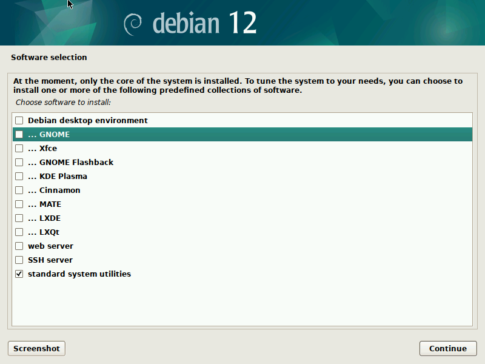

# How to get a colibri

We are going to describe how to go from a minimal standard installation to a complete remasterable system using get-eggs.

 This procedure work on Debian (buster, bulleye, bookworm), Devuan (chimaera and daedalus), Ubuntu (bionic, focal and jammy) and Arch rolling.

## Arch
I started with latest version of archiso: `archlinux-2023.09.01-x86_64.iso`.

Then, used `archinstall` to get a minimal installation. On `Disk configuration` choose `Use a best-effort deault configuration layot`, then `btrfs` or `ext4`, as you prefer.

Among the packages added: `git`, `lsb-release`, others packages will be installed later by `get-eggs`.

At this point, we MUST configure network, I just choose the most basic: `Copy ISO configuration to installation`.

Finally select install and wait it finish. Archinstall will propose you to chroot to continue configuration, answer no and reboot.

## Debian/Devuan/Ubuntu
On Debian and Devuan we start with a common netinst, without install nothing except `standard system utilies`

When the installation finish, reboot the system.

We need now to install `git` and `sudo`.

Log on your system, then:

* `su`
* `apt install git sudo`
* `/usr/sbin/adduser artisan sudo`

We can logout, and we are ready to the next step.

On Ubuntu, we install with the server edition, again without install nothing except the minimal base. Here, at the end of installation I use to remove package `cloud-init` we are not interested on.

After reboot, we need just to install `git` to be ready: `sudo apt install git`.

# Get and run get-eggs (all)

* `git clone https://github.com/pieroproietti/get-eggs`
* `cd get-eggs`
* `sudo ./get-eggs.sh`

# That will happen
eggs will be installed and configured properly for the chosen distribution.

## Arch
`get-eggs.sh` will install few packages `bash-completion`, `dialog`, `man-db`, `nano`, `openssh` and `wget` and will add [AUR](https://aur.archlinux.org/)  repository to pacman.conf.

At last `get-eggs.sh` will install penguins-eggs.

## Debian/Devuan and Ubuntu
`get-eggs.sh` will install new `ppa` for `penguins-eggs`, then will install eggs and its dependencies.

# Get wardrobe and wear a costume (all)
Once eggs was installed, I proceeded to load the wardrobe and "dress" the system with the colibri costume.
* `eggs wardrobe get`
* `sudo eggs wardrobe wear colibri`

At this point after rebooting, I found myself in the colibri graphical system and proceeded to install calamares with the command: `sudo eggs calamares --install`.

Well, we are ready to remaster the system, just a little reconfiguration and cleaning before:

* `sudo eggs dad -d`
* `sudo eggs tools clean`
* `sudo eggs produce --max --addons adapt`

That's all folks!

